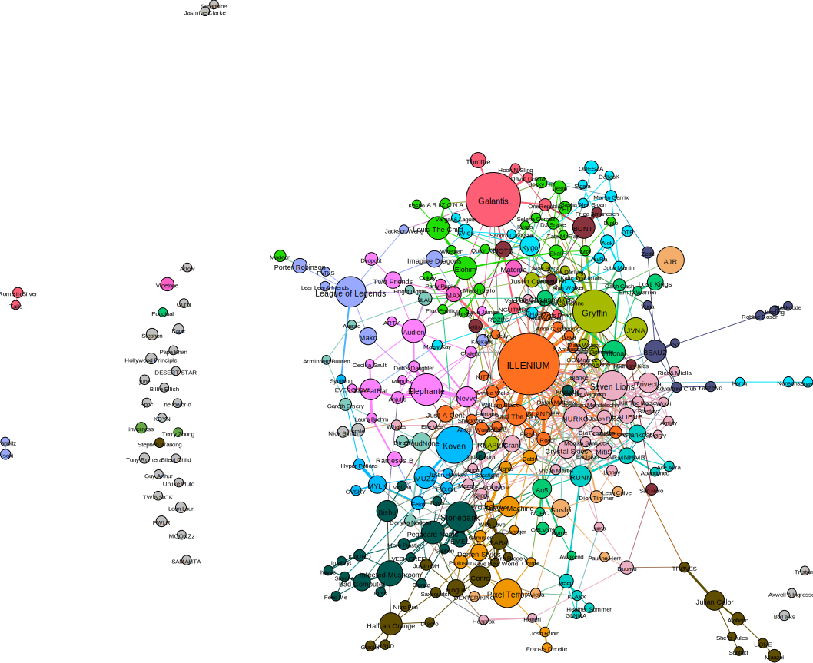

# Spotify Artist Graph

## The python part

1. Create venv and install requirements

    ```bash
    cd your-path-to-spotify-artist-graph
    python3 -m venv venv
    source venv/bin/activate
    pip install -r requirements.txt
    ```
2. Create a Spotify app and get the client id and secret 
   * Creating an app:
      1. Make an app on https://developer.spotify.com/dashboard/applications 
      2. Get the client id and secret
      3. Replace the cli_id and cli_key in the config file
      4. Add a callback to http://localhost:8888/callback in the app settings (on the Spotify developer dashboard)
3. Get your playlist id
   * Copy the link to your playlist
   * Get the id from the link
     * For example:
       * Link: https://open.spotify.com/playlist/7vKQDlskaXBK4cPeglVczM?si=94c7b80c7ac34c3b
       * Id = 7vKQDlskaXBK4cPeglVczM
   * Edit the config file and replace the playlist id
4. Run the script
   1. 
      ```bash
      python3 main.py
      ```
      * This will create a pickle file with all the tracks in your playlist. As long as this file exists, it will not call the Spotify API again. If you want to refresh the data, delete the pickle file.
   2. This will create a `graph.gefx` file in the root directory. This file can be opened in Gephi.


## Gephi

* Get Gephi [here](https://gephi.org/users/download/).

* Follow [this tutorial](https://gephi.org/tutorials/gephi-tutorial-quick_start.pdf) to learn how to quickly customize your graph.
* You can play around with the settings to get a better graph. 
  * I recommend to use the Force Atlas layout algorithm.
  * You can scale the nodes on the "size" attribute. This is the number of times the artist appears in your playlist.
    * Appearance -> Nodes (Size) -> Ranking -> select "size" -> set a min and a max size
  * After running the "Modularity" statistics, you can color the nodes on the "Modularity Class" attribute. This will color the nodes based on the communities that the algorithm found. 
    * Appearance -> Nodes (Color) -> Partition -> select Modularity Class
  * If your graph is big, you can add a filter to only show nodes of a certain size. 
    * Filters -> Attributes -> Range -> Size
  * Remember to reapply the layout algorithm anb appearance after changing the settings.

## Example
